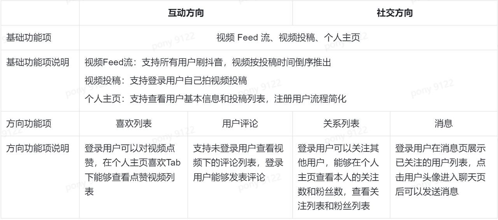
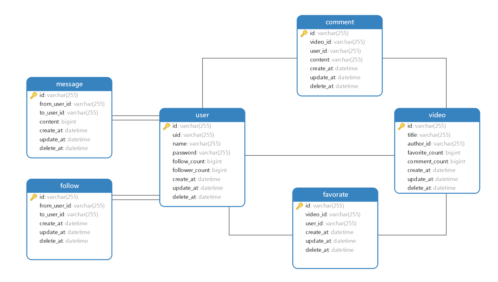
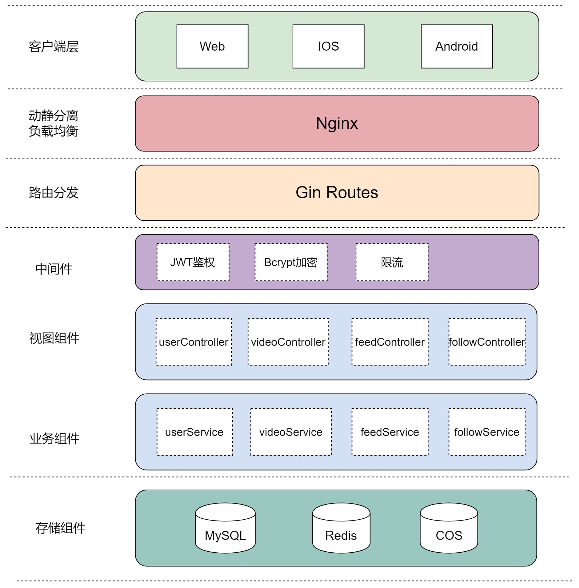

# tiny-douyin
A Simple Backend Service for Short Video Platform Implements by Golang

## 环境
~~使用windows本地环境开发，基于所有sdk均基于wsl2 ubuntu18.04~~

使用 Windows 环境进行开发（wsl的ip问题没能解决，关机后ip会变）

## 系统设计
### 需求分析

### 数据库设计

**NOTE: 在高并发场景下，取消DB层面的外键约束，由应用层实现**

### 技术栈
| 语言     | Golang 1.19 |
|--------|-------------|
| 数据库    | MySQL 8.x   |
| HTTP框架 | Gin         |
| ORM框架  | GORM        |
| 加密     | bcrypt      |
| 视频处理   | ffmpeg      |
| 缓存     | Redis       |
| 对象存储   | Tencent COS |

### 架构设计
由于时间有限，且对Golang微服务生态不了解，因此拟采用单体架构开发，后续考虑采用微服务架构重构

整体采用SpringBoot的三层架构实现，即 controller - service - dao

## TODO
- 分库分表
- 读写分离
- 微服务化

## 鸣谢
- 字节跳动青训营
